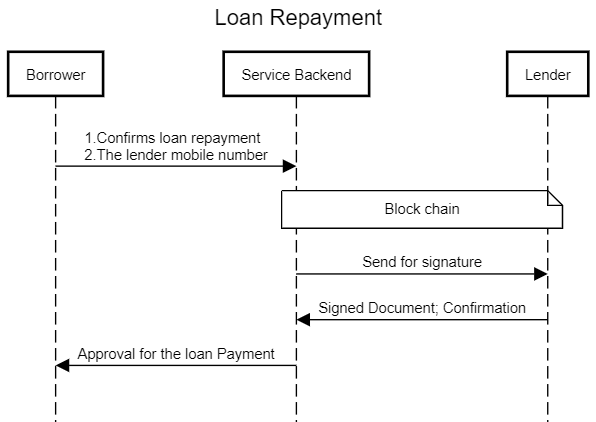
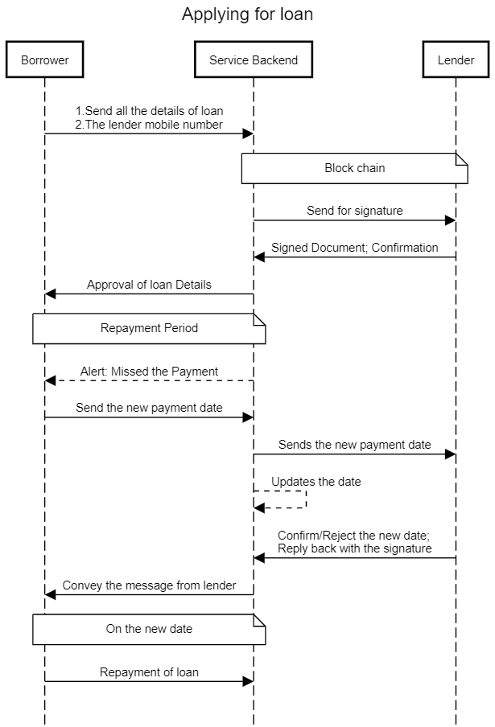

# Microfinance Helper

This is a microfinancing monitoring and helper application which helps to keep track and provide score for the lender as well as the borrower. 

## What is Micro Finance ?
Microfinance is a banking service provided to unemployed or low-income individuals or groups who otherwise would have no other access to financial services. 

## Why is it needed?
Microfinance allows people to take on reasonable small business loans safely, and in a manner that is consistent with ethical lending practices.
The majority of microfinancing operations occur in developing nations.

## What are the challenges faced?
- The process is informal.
- There exist no authoritative rating mechanism exisiting for the sector.
- Largely non-monitored.

## What issues are we trying to address?
- Monitor loans with does not involve a Bank or NBFC.
- Monitoring the flow of loan money 
- Rating the payment capability and trust worthiness for the borrower and the lender. 

## How rating works; ToDo - work more on this idea.
- On every defaulting of loan, the score will reduce for the borrower.
- Depending on the loan amount, the score of both borrower and lender will increase. 
- On every successful loan payment, the score of the borrower and lender will increase.

## Activity flow for applying a loan

## Activity flow for loan repayment

## Activity flow for loan defaulting

# TODO Discuss with Legendary people :P
Learn more
